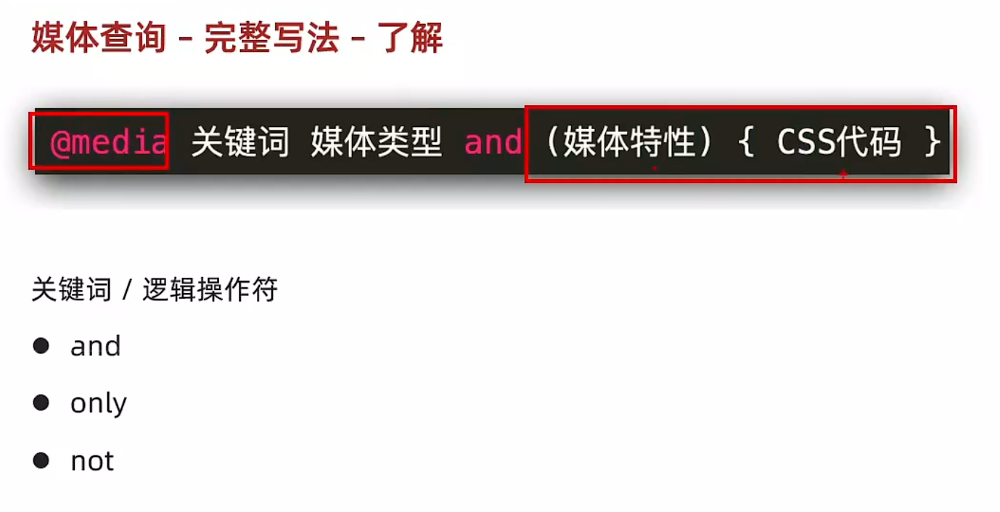
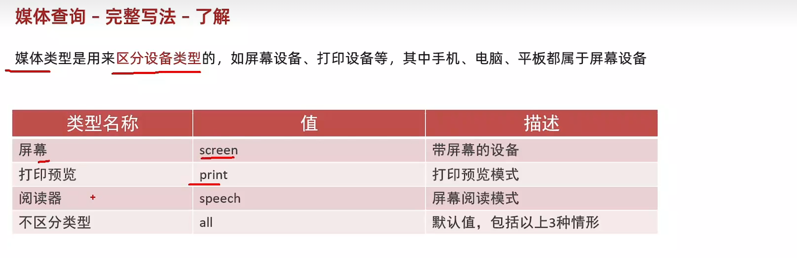

# Day15-d5-移动web-响应式网页

## 1. 响应式
1. 媒体查询
   - 格式
   ```
   @media (媒体查询){
    选择器 {
        样式
    }
   }
   ```

   - 媒体特征
     - max-width:最大宽度
     - min-width:最小宽度

     
     
     
   
2. 书写顺序
    - min-width:(从小到大)
    - max-width:(从大到小)

3. 媒体查询 - 外部css
   - 语法
     ```
     <link rel="stylesheet" media="逻辑符 媒体类型 and (媒体特性)" href="XX.css">
     注意
        - 逻辑符和媒体特性可以不写
     ```

## 2. Bootstrap框架 
4. Bootstrap - 简介
   - Bootstrap框架是由Twitter公司开发维护分前端框架，它提供了大量编好的CSS样式，
     允许开发者结合一定HTML和JavaScript,快速编写功能完善的网页及常见交互效果

5. 使用步骤
   - 引入Bootsteap CSS 文件
   ```
   <link rel="stylesheet" herf="路径">
   ```

   - 调用类名
     ```
     <div class="container">测试</div>
     ```

6. Bootstrap - 栅格系统
   - 栅格系统指定的将整个网页的宽度分成12等份，每个盒子占用对应的份数
   - 例如：一行排4个盒子，则每个盒子占3份即可 (12 / 3 = 4)
   - 常用布局
     - col-*-*: 列(例如：col-xxl-3)
     - row:行
   
   
   
   |      |  x < 576px   |    sm>=576px  |   md>= 768px   |     lg>= 992px |   xl>= 1200px    |    xxl>=1400px  |
   | ---- | ---- | ---- | ---- | ---- | ---- | ---- |
   | Container(min-width) | None(auto) |   540px   |    720px  |     960px |    1140px  | 1320px     |
   |      | .col- | .col-sm- | .col-md- | .col-lg | .col-xl | ,col-xxl |
   |      |      |      |      |      |      |      |


7. Bootstrap - 全局样式
   - 按钮(Button类)
     - btn：默认
     - btn-success: 成功
     - btn-waining: 警告
     - ...
     - 按钮尺寸: btn-lg/btn-sm

   - 表格(Table)
     - table: 默认样式
     - table-striped： 隔行变色
     - table-success： 表格颜色
     - ....

   - 组件(Components)
     - 使用步骤
       - 引入样式表
       - 引入js文件
       - 复制结构 修改内容

   - 字体图标
      - 下载 
        - 导航/Extend：图标库 -> 安装 -> 下载安装包 -> bootstrap-icons-1.X.X.zip
      
      - 使用
        - 复制fonts文件夹到项目目录
        - 网页引入bootstrap-icons.css文件
        - 调用CSS类名(图标对应类名)
          ```css
          <i class="bi-android2"></i>
          ```
   

​		